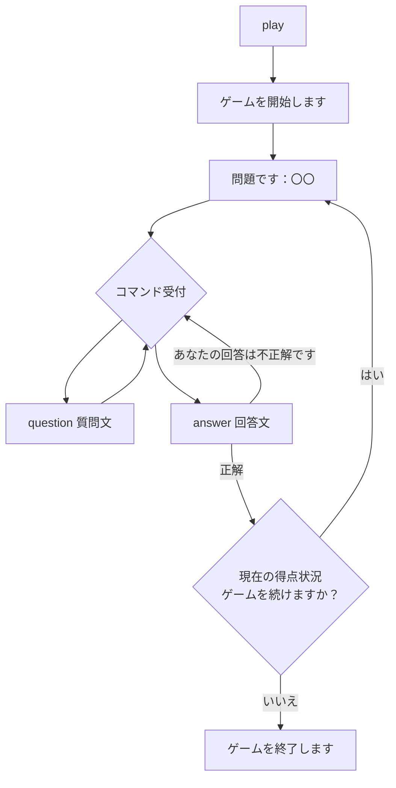

# flowchart

```mermaid
flowchart TD
    A[play] --> B[ゲームを開始します]
    B --> C[問題です：〇〇]
    C --> D{コマンド受付}
    D --> E[question 質問文]
    D --> F[answer 回答文]
    E --> D
    F --> |正解|H{現在の得点状況 \n ゲームを続けますか？}
    F --> |あなたの回答は不正解です| D
    H --> |はい|C
    H --> |いいえ|I[ゲームを終了します]

```